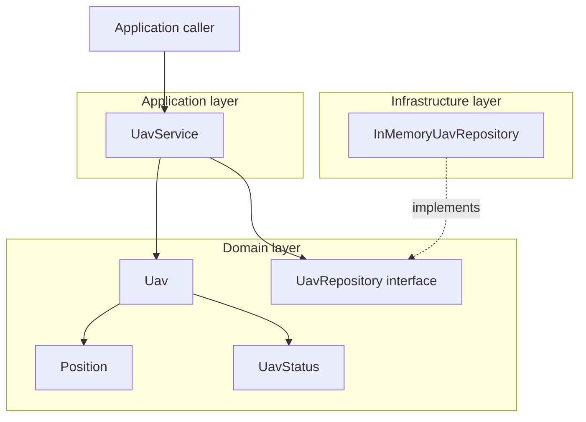
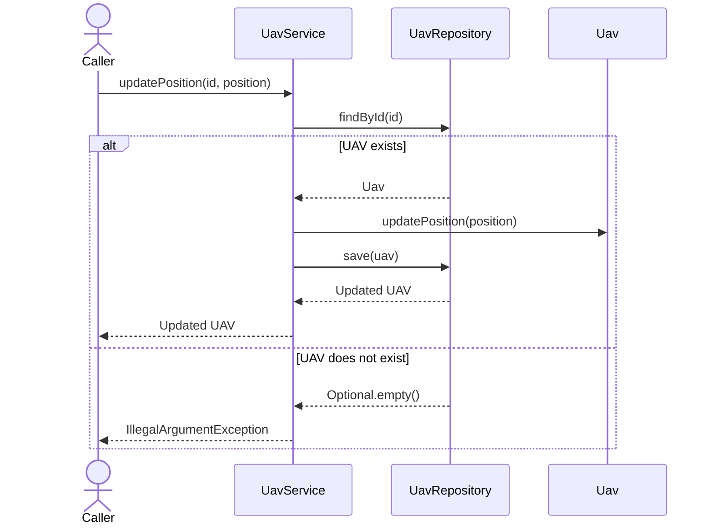

# UAV Mission Control

**A Java backend foundation for UAV telemetry, operational state, and command workflows.**

[](https://openjdk.org/)
[](https://spring.io/projects/spring-boot)
[](LICENSE)

Mission Control is being developed to connect UAV clients and operator interfaces through a single WebSocket/STOMP channel. Its goal is to support real-time position updates, controlled state transitions, and traceable command execution.

The current backend implements the core UAV model, application services, an in-memory repository, and WebSocket/STOMP configuration.

> **Development status — Backend MVP.** Registration, lookup, position updates, and status updates are available through the application service. External STOMP handlers, outbound telemetry, and command execution are planned. The current implementation is not yet an end-to-end flight-control system.

[Quick start](#quick-start) · [Capabilities](#capabilities) · [Architecture](#architecture) · [Messaging](#websocket-and-stomp) · [Roadmap](#roadmap)

## Capabilities

| Area | Current implementation | Next step |
|---|---|---|
| UAV registry | Register and retrieve UAVs; reject duplicate identifiers | Require the reported registration state and expose STOMP handlers |
| Position tracking | Update the current position with coordinate validation | Receive telemetry and publish updates |
| Operational state | Store and update `UavStatus` | Enforce permitted state transitions |
| Commands | Initial `UavCommand` contract | Implement execution, acknowledgements, and timeouts |
| Messaging | WebSocket endpoint and STOMP broker configuration | Add message DTOs, handlers, and outbound events |
| Storage | In-memory repository backed by `ConcurrentHashMap` | Add durable persistence |
| Testing | Domain tests and Spring context startup tests | Extend service, messaging, and integration coverage |

## Quick Start

### Prerequisites

- **JDK 25**, available on `PATH` and configured through `JAVA_HOME` where required.
- **Git**.

The repository includes the Maven Wrapper; a separate Maven installation is not required. Build and dependency versions are defined in `pom.xml` and `.mvn/wrapper/maven-wrapper.properties`.

### Clone and run

```bash
git clone https://github.com/FranciscoGoal/UAV-Mission-Control.git
cd UAV-Mission-Control
```

**Linux / macOS**

```bash
./mvnw spring-boot:run
```

If the wrapper is not executable, run `chmod +x mvnw` once.

**Windows — PowerShell**

```powershell
.\mvnw.cmd spring-boot:run
```

By default, the server starts on port `8080`. The WebSocket handshake endpoint is:

```text
ws://localhost:8080/ws
```

Use a STOMP-capable WebSocket client. Starting the server makes the transport available; application messaging requires the planned handlers. The `/ws` endpoint does not serve an operator dashboard.

### Build and test

| Task | Linux / macOS | Windows — PowerShell |
|---|---|---|
| Run tests | `./mvnw clean test` | `.\mvnw.cmd clean test` |
| Package the application | `./mvnw clean package` | `.\mvnw.cmd clean package` |

After packaging, run the executable JAR generated in `target/`:

```bash
java -jar target/MissionControl-0.0.1-SNAPSHOT.jar
```

The filename reflects the artifact name and version currently declared in `pom.xml`.

## Architecture

Mission Control uses a layered architecture with a repository port and an infrastructure adapter. The domain contains UAV data and validation rules; the application service coordinates use cases; infrastructure supplies storage and messaging configuration.



The diagram shows the current use-case and persistence dependencies. WebSocket configuration exists separately; message handlers will connect the transport to the application service.

| Component | Responsibility |
|---|---|
| `Uav` | Holds the identifier, current position, and operational status |
| `Position` | Immutable value object that validates coordinates and altitude |
| `UavStatus` | Defines the available operational states |
| `UavService` | Coordinates registration, retrieval, position updates, and status updates |
| `UavRepository` | Defines the persistence contract used by the application service |
| `InMemoryUavRepository` | Implements the repository using an in-memory concurrent map |
| `WebSocketConfiguration` | Configures the handshake endpoint and STOMP destination prefixes |

The domain has no Spring dependencies. The repository interface keeps application use cases independent of the storage implementation.

### Position update flow



### Application service usage

The current entry point is an injected `UavService`. This example is a method body in a Spring-managed component that receives the service through constructor injection:

```java
UUID id = UUID.randomUUID();
Position position = new Position(42.28, -8.73, 0);

Uav registered = uavService.registerUav(id, position);
uavService.updateStatus(id, UavStatus.TAKING_OFF);
uavService.updatePosition(id, new Position(42.29, -8.74, 20));
Uav current = uavService.getUav(id);
```

The snippet uses `java.util.UUID` and the domain types `Position`, `Uav`, and `UavStatus`. It demonstrates internal service calls; there is no corresponding external message handler yet.

Registering an existing identifier throws `IllegalArgumentException`. Retrieving or updating an unregistered UAV throws the same exception type. `findAll()` is available on the repository interface, but is not currently exposed by `UavService`.

## Domain Rules

| Property | Constraint |
|---|---|
| UAV identifier | Must not be `null` |
| Initial status | `GROUND` |
| Latitude | Finite value between `-90` and `90` |
| Longitude | Finite value between `-180` and `180` |
| Altitude | Finite value greater than or equal to `0` |
| Position and status updates | Must not be `null` |

Available statuses are `GROUND`, `TAKING_OFF`, `FLYING`, `RETURNING_HOME`, `LANDING`, and `DISCONNECTED`.

These values currently describe state. Transition rules are not yet enforced: defining the enum does not prevent an invalid jump between states.

## WebSocket and STOMP

WebSocket/STOMP is the planned external interface for telemetry, commands, and notifications. The project is designed around one WebSocket connection per client, with STOMP destinations separating message types. REST endpoints are outside the current interface design.

| Setting | Configured value | Purpose |
|---|---|---|
| Handshake endpoint | `/ws` | Establish the WebSocket connection |
| Application prefix | `/app` | Route messages to application handlers once implemented |
| Broker prefixes | `/topic`, `/queue` | Route messages through the simple broker |
| User destination prefix | `/user` | Support user-specific destination resolution |

These are infrastructure settings, not a complete application messaging API. Registration, telemetry, and command destinations and payloads will be documented alongside their implementations.

User destinations also require an appropriate session and identity design; a configured `/user` prefix does not provide authentication or authorization.

## Technology

| Technology | Role |
|---|---|
| Java 25 | Language and runtime |
| Spring Boot 4.1.1 | Application bootstrap and dependency injection |
| Spring WebSocket / STOMP | Bidirectional messaging infrastructure |
| Maven Wrapper / Maven 3.9.16 | Build and dependency management |
| JUnit Jupiter | Automated tests |
| Mermaid | Architecture and interaction diagrams |

## Code Organization

Java sources are organized under `src/main/java/com/example/missioncontrol`.

| Package or file | Contents |
|---|---|
| `MissionControlApplication.java` | Spring Boot entry point |
| `application/service` | Application use cases |
| `domain/model` | UAV entity, position value object, and statuses |
| `domain/model/command` | Initial command contract |
| `domain/model/repository` | Repository interface |
| `infrastructure/repository` | In-memory storage adapter |
| `infrastructure/websocket` | WebSocket/STOMP configuration |

Application settings are in `src/main/resources/application.properties`. Tests are under `src/test/java/com/example/missioncontrol`.

## Testing

The repository contains four tests: three domain tests covering initial UAV status, position updates, and status updates, plus one Spring application context startup test.

Service behavior, message contracts, command processing, and concurrent updates need further coverage as those workflows develop.

## Engineering Considerations

- **Validation belongs in the domain.** `Position` rejects invalid coordinates at construction, keeping its invariants independent of the transport.
- **Storage is replaceable.** Application services depend on `UavRepository`, allowing a durable adapter to be introduced behind the same contract.
- **In-memory state is temporary.** Registered UAVs and their current values are lost when the process stops. Telemetry history is not retained.
- **Service operations share one lock.** All four public `UavService` methods are `synchronized`, so calls through the same service instance execute one at a time, including calls for different UAVs. This is mutual exclusion, not asynchronous command processing. Returned `Uav` objects remain mutable; direct entity or repository access bypasses that service lock.
- **Protocol errors are still to be defined.** Domain and application errors are not yet mapped to client-facing STOMP error messages.
- **Access control is pending.** Authentication and authorization are not implemented.

## Architecture Decisions

[ADR-001 — Require the current UAV status during registration](docs/adr/001-explicit-uav-status-registration.md) proposes accepting the reported operational state when a UAV registers. This supports scenarios where Mission Control starts tracking an aircraft that is already flying.

**Status: proposed, not implemented.** The current constructor is still `Uav(UUID id, Position position)`, and `registerUav(UUID id, Position initialPosition)` still initializes the UAV as `GROUND`. The ADR describes the intended change; the code and tests retain the existing behavior.

## Roadmap

The following stages describe the intended development order, without release-date commitments.

### 1. Complete the messaging loop

- [ ] Implement explicit registration status as proposed in ADR-001.
- [ ] Define message DTOs and application destinations.
- [ ] Add STOMP handlers for registration and telemetry.
- [ ] Publish position and status updates.
- [ ] Define consistent client-facing error responses.
- [ ] Add messaging contract and integration tests.
- [ ] Add a CI workflow to run the test suite on pushes and pull requests.

### 2. Implement controlled command execution

- [ ] Enforce valid UAV state transitions.
- [ ] Implement asynchronous command processing.
- [ ] Track command acknowledgements, results, and expiration.
- [ ] Define and test concurrent update behavior.

### 3. Extend persistence and operational capabilities

- [ ] Introduce persistent storage and schema migrations.
- [ ] Retain telemetry history and add mission tracking.
- [ ] Secure WebSocket sessions and authorize messaging operations.
- [ ] Add metrics, health monitoring, and structured logging.
- [ ] Package the application with Docker.

## License

Distributed under the [MIT License](LICENSE).
