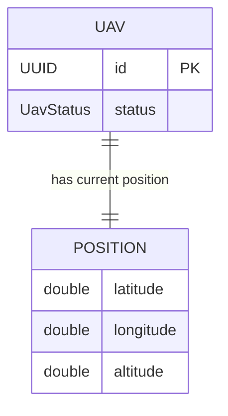
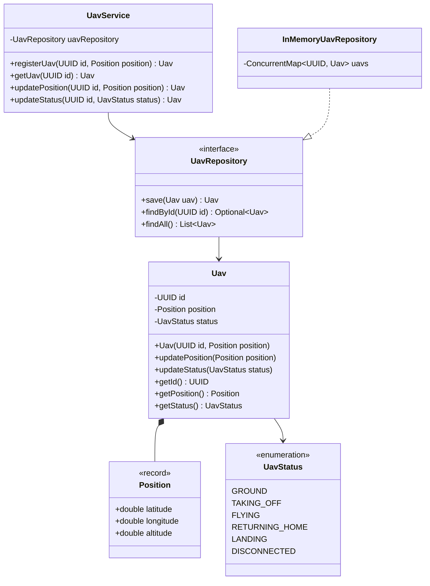
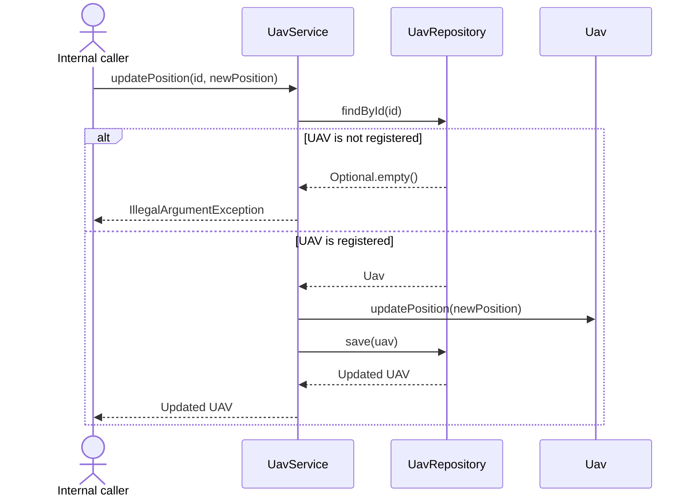
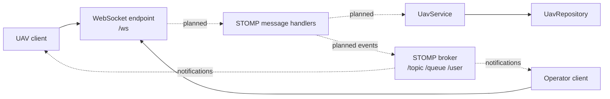

# UAV Mission Control

[](https://openjdk.org/)
[](https://spring.io/projects/spring-boot)
[](https://github.com/FranciscoGoal/UAV-Mission-Control/actions/workflows/ci.yml)
[](LICENSE)

An event-driven backend foundation for managing Unmanned Aerial Vehicles (UAVs) through real-time WebSocket/STOMP communication.

The project models UAV registration, position tracking, operational status management, in-memory persistence, and messaging infrastructure. Its design follows layered and hexagonal architecture principles, keeping the domain independent from framework and infrastructure concerns.

> **Project status:** backend MVP under active development. The domain and application layers are functional; STOMP message handlers and outbound telemetry events are on the roadmap.

## Contents

- [Highlights](#highlights)
- [Technology Stack](#technology-stack)
- [Architecture](#architecture)
- [Domain Model](#domain-model)
- [Application Flow](#application-flow)
- [WebSocket and STOMP](#websocket-and-stomp)
- [Project Structure](#project-structure)
- [Getting Started](#getting-started)
- [Testing](#testing)
- [Design Decisions](#design-decisions)
- [Current Limitations](#current-limitations)
- [Roadmap](#roadmap)
- [License](#license)

## Highlights

- Framework-independent domain model.
- Geographic position validation through an immutable value object.
- UAV registration, lookup, position updates, and status updates.
- Repository abstraction based on dependency inversion.
- Thread-safe in-memory repository adapter.
- STOMP broker configuration over WebSocket.
- Automated domain and Spring context tests.
- Continuous integration with GitHub Actions.

## Technology Stack

| Technology | Version | Purpose |
|---|---:|---|
| Java | 25 | Language and runtime |
| Spring Boot | 4.1.1 | Application framework |
| Spring WebSocket | Managed by Spring Boot | WebSocket and STOMP infrastructure |
| Maven Wrapper | Maven 3.9.16 | Reproducible build and dependency management |
| JUnit Jupiter | Managed by Spring Boot | Automated testing |
| ConcurrentHashMap | JDK | Thread-safe in-memory persistence |
| Mermaid | GitHub native | Technical diagrams |

## Architecture

The codebase follows a layered design influenced by hexagonal architecture. The application service depends on a domain repository port, while infrastructure supplies the concrete adapter.

```mermaid
flowchart LR
    Caller[Internal application caller]

    subgraph Application
        Service[UavService]
    end

    subgraph Domain
        Uav[Uav]
        Position[Position]
        Status[UavStatus]
        RepositoryPort[UavRepository]
        Command[UavCommand]
    end

    subgraph Infrastructure
        MemoryRepository[InMemoryUavRepository]
        WebSocket[WebSocketConfiguration]
        Broker[STOMP Simple Broker]
    end

    Caller --> Service
    Service --> RepositoryPort
    Service --> Uav
    MemoryRepository -. implements .-> RepositoryPort
    MemoryRepository --> Uav
    Uav *-- Position
    Uav --> Status
    WebSocket --> Broker
    Command -. initial contract .-> Uav
```

| Layer | Responsibility |
|---|---|
| Domain | Entities, value objects, validation rules, statuses, and repository contracts |
| Application | Coordinates UAV use cases and persistence operations |
| Infrastructure | Supplies in-memory persistence and WebSocket/STOMP configuration |
| Bootstrap | Starts Spring Boot and discovers application components |

The domain model has no dependency on Spring. Framework-specific annotations remain in the application bootstrap, service, and infrastructure adapters.

## Domain Model

`Uav` is the aggregate entity. It owns a current `Position` value and a `UavStatus`. The repository is currently in memory, so the following diagram represents conceptual domain relationships rather than a relational database schema.



### Class Model



### Domain Invariants

| Property | Rule |
|---|---|
| UAV identifier | Cannot be `null` |
| Initial UAV status | `GROUND` |
| Latitude | Finite value from `-90` to `90` |
| Longitude | Finite value from `-180` to `180` |
| Altitude | Finite value greater than or equal to `0` |
| Updated position or status | Cannot be `null` |

## Application Flow

The following sequence shows the currently implemented application flow. STOMP handlers will become the external entry point without changing the use case or domain layers.



## WebSocket and STOMP

The project uses WebSocket as its only planned external communication channel. STOMP provides application destinations, publish-subscribe topics, queues, and user-specific destinations.

| Configuration | Destination |
|---|---|
| WebSocket handshake | `/ws` |
| Application prefix | `/app` |
| Simple broker | `/topic`, `/queue` |
| User destinations | `/user` |

### Target Messaging Flow

Dashed connections represent the STOMP adapters and publications that are not implemented yet.



The transport and broker are configured. `@MessageMapping` handlers, message DTOs, and telemetry publications remain future work.

## Project Structure

```text
src
├── main
│   ├── java/com/example/missioncontrol
│   │   ├── MissionControlApplication.java
│   │   ├── application/service
│   │   │   └── UavService.java
│   │   ├── domain/model
│   │   │   ├── command/UavCommand.java
│   │   │   ├── repository/UavRepository.java
│   │   │   ├── Position.java
│   │   │   ├── Uav.java
│   │   │   └── UavStatus.java
│   │   └── infrastructure
│   │       ├── repository/InMemoryUavRepository.java
│   │       └── websocket/WebSocketConfiguration.java
│   └── resources
│       └── application.properties
└── test
    └── java/com/example/missioncontrol
        ├── MissionControlApplicationTests.java
        └── domain/model/UavTest.java
```

## Getting Started

### Requirements

- JDK 25 or newer.
- Git.
- No local Maven installation is required; the Maven Wrapper is included.

### Clone

```bash
git clone https://github.com/FranciscoGoal/UAV-Mission-Control.git
cd UAV-Mission-Control
```

### Run

Linux and macOS:

```bash
./mvnw spring-boot:run
```

Windows:

```powershell
.\mvnw.cmd spring-boot:run
```

The application starts on port `8080` by default and exposes the WebSocket handshake endpoint at `/ws`.

### Package

```bash
./mvnw clean package
java -jar target/MissionControl-0.0.1-SNAPSHOT.jar
```

## Testing

Run the complete test suite from a clean build:

```bash
./mvnw clean test
```

Current automated coverage includes:

- Spring application context startup.
- Initial UAV status.
- Position updates.
- Status updates.

GitHub Actions runs the clean test suite on every push and pull request to `main`.

## Design Decisions

### WebSocket-Only Communication

Mission control requires bidirectional, low-latency communication. WebSocket/STOMP is therefore the external interface for UAV telemetry, commands, and notifications.

### Validation at the Domain Boundary

`Position` is an immutable value object. Invalid geographic coordinates cannot be constructed, keeping validation close to the business model.

### Dependency Inversion

`UavService` depends on `UavRepository`, not on its in-memory implementation. A persistent adapter can replace the current repository without changing the application use cases.

### In-Memory Persistence

`InMemoryUavRepository` uses `ConcurrentHashMap`. This keeps the MVP lightweight while preserving a clear migration path to durable storage.

## Current Limitations

- Data is lost when the application stops.
- STOMP message handlers and outbound telemetry events are not implemented yet.
- UAV status transitions are not enforced as a state machine.
- `UavCommand` is an initial contract without concrete command implementations.
- Authentication and authorization are not implemented.
- Telemetry history is not retained.
- Domain errors are not yet translated into protocol-specific messages.
- Test coverage currently focuses on the domain core and application startup.

## Roadmap

- [ ] Add `@MessageMapping` handlers for registration and telemetry.
- [ ] Publish position and status events to STOMP topics.
- [ ] Complete asynchronous UAV command processing.
- [ ] Add command acknowledgements, results, and expiration handling.
- [ ] Introduce validated UAV state transitions.
- [ ] Add persistent storage and schema migrations.
- [ ] Secure WebSocket sessions and user destinations.
- [ ] Add telemetry history and mission tracking.
- [ ] Add STOMP contract and integration tests.
- [ ] Add metrics, health monitoring, and structured logging.
- [ ] Package the application with Docker.

## License

Distributed under the [MIT License](LICENSE).
