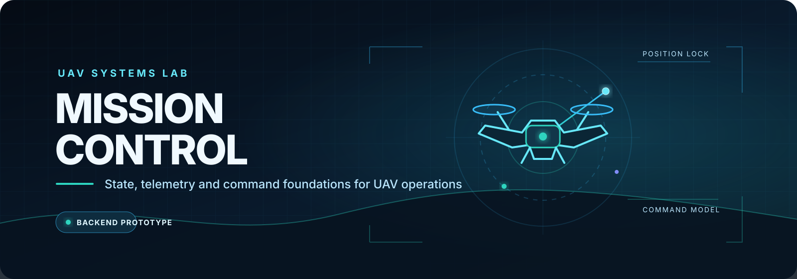

<p align="center">
  
</p>

<p align="center">
  
  
  <a href="LICENSE"></a>
</p>

<p align="center">
  <strong>A domain-first backend for UAV state, telemetry, and command workflows.</strong>
</p>

Mission Control is an open-source Java project exploring the backend foundations of a UAV operations platform. It brings aircraft identity, position, operational state, and command tracking into one coherent model, with a clear path toward real-time messaging, simulation, and an operator-facing control experience.

The repository is intentionally being built from the core outward: establish reliable domain rules and storage boundaries first, then connect transport, command execution, persistence, simulation, and presentation.

## At a Glance

| UAV state | Command model | Messaging foundation | Development safety net |
|:---|:---|:---|:---|
| Register aircraft and maintain their latest validated position and reported status. | Model takeoff, navigation, landing, return-home, and initialize execution snapshots. | Accept position updates at `/app/telemetry` over WebSocket/STOMP with an in-process broker. | Exercise domain, service, repository, concurrency, configuration, controller, and context behavior with automated tests. |

### What works today

- **UAV registry:** register and retrieve aircraft through `UavService`, with duplicate-ID protection.
- **Validated position state:** enforce finite coordinates, geographic bounds, and non-negative altitude.
- **Operational state:** record `GROUND`, `TAKING_OFF`, `FLYING`, `RETURNING_HOME`, `LANDING`, or `DISCONNECTED` without inventing a default at registration.
- **Command vocabulary:** represent `TAKE_OFF`, `GO_TO`, `LAND`, and `RETURN_HOME` with identity and expiration metadata.
- **Execution snapshots:** retain the latest recorded command status while rejecting older updates or changed command definitions.
- **Execution initialization:** create a `PENDING` execution for a stored command through `CommandService`.
- **STOMP position ingestion:** accept a validated `Position` at `/app/telemetry`, derive the UAV identifier from the connection principal, and update the registered aircraft.
- **Replaceable storage boundaries:** keep UAV, command, and execution data behind repository interfaces with concurrent in-memory adapters.

## Architecture

Mission Control has a partial inbound telemetry flow: messages sent to `/app/telemetry` are handled by `TelemetryController` and update the latest position of an already registered UAV through `UavService`. Internal callers can also register, retrieve, and update UAVs directly through that service. A separate `CommandService` initializes a `PENDING` execution for a command already present in the command repository.

<p align="center">
  <a href="docs/diagrams.md">
    
  </a>
</p>

All current repositories are process-local and in memory. The `Telemetry` record models a richer snapshot, but the active STOMP handler currently consumes only `Position`. There is no database, telemetry history, external message broker, command dispatcher, simulator, or operator interface in this version.

## Run Mission Control

### Requirements

- JDK 25
- Git, if cloning the repository

The Maven Wrapper is included; a separate Maven installation is not required.

```bash
git clone https://github.com/FranciscoGoal/UAV-Mission-Control.git
cd UAV-Mission-Control
./mvnw spring-boot:run
```

The server starts on port `8080` and exposes the WebSocket handshake endpoint at `ws://localhost:8080/ws`. STOMP application messages use the `/app` prefix, while the in-process broker is configured for `/topic` and `/queue` destinations and `/user` destinations are enabled.

The current inbound application destination is `/app/telemetry`. It accepts a position payload:

```json
{
  "latitude": 42.29,
  "longitude": -8.74,
  "altitude": 50.0
}
```

This flow requires the UAV to have been registered through an internal caller and the connection `Principal` name to be that UAV's UUID. Authentication, external registration, outbound state publication, acknowledgements, and protocol-level error responses are not implemented yet.

On Windows PowerShell, run `.\mvnw.cmd spring-boot:run` instead. To verify or package the project:

```bash
./mvnw clean test
./mvnw clean package
java -jar target/MissionControl-0.0.1-SNAPSHOT.jar
```

## Roadmap

The roadmap separates the current backend foundation from the capabilities still to come. It expresses development direction, not release commitments.

### Backend foundation

- [x] Model UAV identity, position, and reported operational status.
- [x] Validate geographic coordinates and altitude.
- [x] Provide in-memory UAV, command, and execution repositories.
- [x] Model takeoff, navigation, landing, and return-home commands.
- [x] Retain the latest command execution snapshot.
- [x] Configure WebSocket/STOMP transport and an in-process broker.
- [x] Accept UAV position updates at `/app/telemetry`.
- [x] Initialize `PENDING` command executions for stored commands.

### Real-time messaging

- [ ] Expose UAV registration through a documented transport contract.
- [ ] Integrate the richer `Telemetry` model with the active messaging flow.
- [ ] Publish UAV state and telemetry updates to subscribers.
- [ ] Define acknowledgements and consistent protocol errors.
- [ ] Add authentication and reliable UAV identity binding.
- [ ] Detect stale or out-of-order telemetry.

### Command loop

- [ ] Validate that a command targets a registered UAV.
- [ ] Expose command creation through transport.
- [ ] Dispatch commands to UAV clients.
- [ ] Process acknowledgements and results.
- [ ] Enforce command expiration.
- [ ] Define valid UAV and command status transitions.
- [ ] Add retries, timeout handling, and execution history.

### Operational depth

- [ ] Add durable persistence.
- [ ] Store telemetry history.
- [ ] Model missions.
- [ ] Add authorization policies.
- [ ] Build an end-to-end UAV simulator.

### Control experience

- [ ] Add production observability.
- [ ] Add production deployment packaging.
- [ ] Build an operator interface.

Real-aircraft integration would require a separately defined protocol, hardware adapter, safety model, and validation program. None of those are claimed by the current repository.

## Explore the Project

| Resource | Contents |
|---|---|
| [Technical diagrams](docs/diagrams.md) | Static architecture, interaction, state-behavior, and domain-model views. |
| [ADR-001](docs/adr/001-explicit-uav-status-registration.md) | Why registration requires the UAV's current status instead of assuming it is on the ground. |
| [`src/main/java`](src/main/java/com/example/missioncontrol) | Application, domain, repository, and WebSocket implementation. |
| [`src/test/java`](src/test/java/com/example/missioncontrol) | Automated behavior and configuration tests. |

## Project Status

Mission Control is an early backend prototype for engineering and domain exploration. It is not an operational flight-control system and currently provides no real-UAV integration or safety guarantees.

Built and maintained by [FranciscoGoal](https://github.com/FranciscoGoal). Distributed under the [MIT License](LICENSE).
