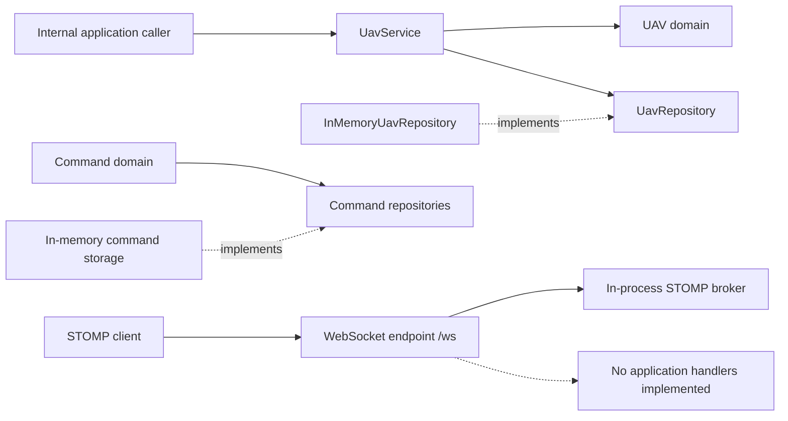

# Mission Control

Mission Control is a Spring Boot backend prototype for tracking unmanned aerial vehicles (UAVs) and modeling command workflows. It provides a small domain-centered foundation for registering aircraft, maintaining their latest position and operational state, and recording commands and execution snapshots in memory.

The project currently exposes these capabilities as Java application and repository APIs. WebSocket/STOMP transport is configured, but there are no application message handlers, REST endpoints, operator interface, simulator, or connection to real UAVs yet.

## Current Capabilities

- Register a UAV with its identifier, current position, and reported operational status.
- Retrieve a registered UAV and update its latest position or status.
- Validate latitude, longitude, altitude, command metadata, takeoff altitude, and `GO_TO` targets in the domain model.
- Represent `TAKE_OFF`, `GO_TO`, `LAND`, and `RETURN_HOME` commands with creation and expiration timestamps.
- Store UAVs, commands, and the latest command-execution snapshot in concurrent in-memory repositories.
- Start a Spring WebSocket/STOMP server with an in-process simple broker.

All state is process-local and is lost when the application stops. UAV and command status values are recorded, but transition rules are not enforced. Command dispatch, acknowledgements, completion results, and automatic expiration are not connected to an application workflow.

## Architecture

The code follows a layered structure: domain objects hold validation rules, `UavService` coordinates the implemented UAV use cases, repository interfaces define storage boundaries, and infrastructure adapters keep the current state in memory. The command model and repositories exist as a separate foundation and are not yet connected to a service or messaging handler.



See [Technical Diagrams](docs/diagrams.md) for the implemented flows, state behavior, and domain models.

## Quick Start

### Requirements

- JDK 25
- Git, if cloning the repository

The Maven Wrapper is included, so a separate Maven installation is not required. The first build may need network access to download Maven and project dependencies.

```bash
git clone https://github.com/FranciscoGoal/UAV-Mission-Control.git
cd UAV-Mission-Control
./mvnw spring-boot:run
```

On Windows PowerShell, use `.\mvnw.cmd spring-boot:run`.

The application starts on port `8080` by default. Its WebSocket handshake endpoint is:

```text
ws://localhost:8080/ws
```

The endpoint accepts STOMP connections, but the repository does not yet define application destinations or payload contracts for registration, telemetry, or commands. It does not serve a web interface.

Run the test suite and build the executable JAR with:

```bash
./mvnw clean test
./mvnw clean package
java -jar target/MissionControl-0.0.1-SNAPSHOT.jar
```

Use `mvnw.cmd` instead of `mvnw` for the equivalent Windows commands.

## Documentation

- [Technical diagrams](docs/diagrams.md): architecture, current interaction flows, state behavior, and domain relationships.
- [ADR-001: Require the Current UAV Status During Registration](docs/adr/001-explicit-uav-status-registration.md): rationale for requiring an explicit status when a UAV is registered.

## Roadmap

Mission Control is at an early backend-prototype stage. The intended development path is incremental; the items below describe direction rather than currently available features or release commitments.

### 1. Complete the messaging loop

Define external message contracts and STOMP application destinations, connect UAV registration and telemetry to `UavService`, publish state updates, and provide consistent protocol errors. Contract and integration tests should accompany the external API.

### 2. Connect command execution

Build an application service around the existing command models and repositories. This stage includes target-UAV validation, dispatch, acknowledgements, completion or failure results, expiration handling, and explicit transition rules for UAV and command states.

### 3. Add operational capabilities

Introduce durable storage and telemetry history, then model missions and their assignment to UAVs. A simulator can provide repeatable end-to-end scenarios before any real-aircraft integration is considered. Authentication and authorization are also required before exposing control operations beyond a development environment.

### 4. Prepare operation and presentation

Add health checks, metrics, structured logging, and reproducible deployment packaging. An operator interface can then be built against a stable external API and demonstrated with the simulator.

## Project Status

This repository is suitable for domain modeling and backend experimentation. It is not an operational flight-control system and does not currently demonstrate real-UAV integration, safety guarantees, or a complete telemetry and command loop.

Mission Control is maintained by [FranciscoGoal](https://github.com/FranciscoGoal) and distributed under the [MIT License](LICENSE).
