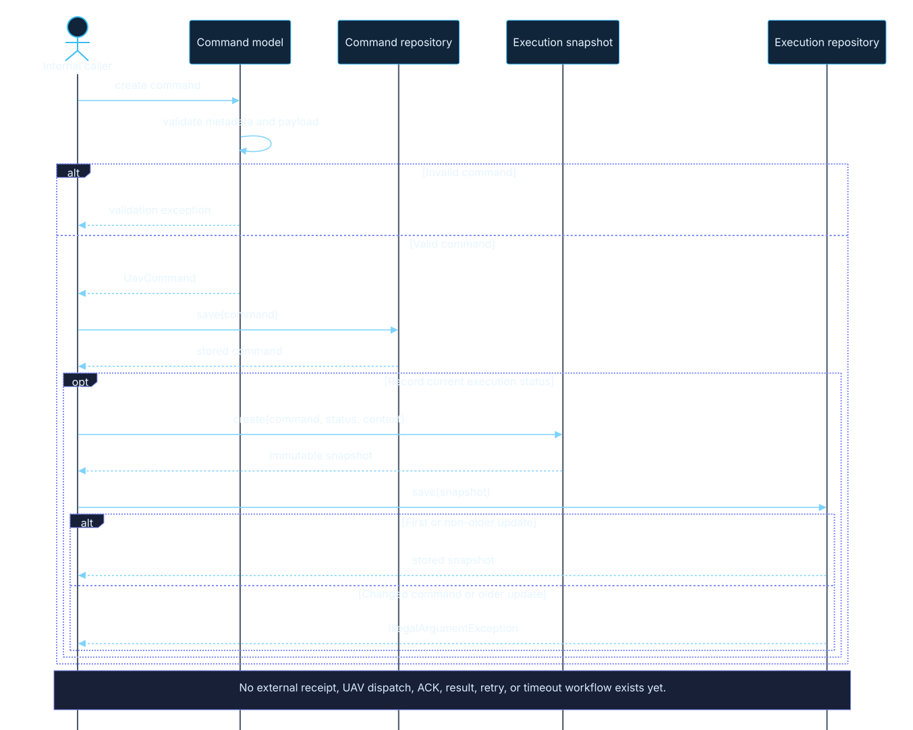
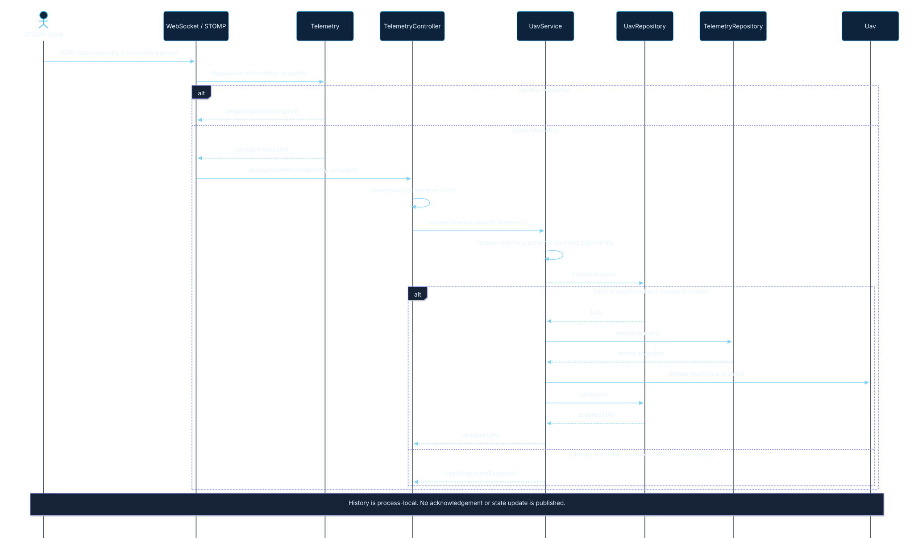

# Mission Control Technical Diagrams

This gallery documents the behavior implemented in the repository today. Every diagram is a committed static SVG for consistent GitHub rendering; editable Mermaid sources live in [`diagram-sources/`](diagram-sources/).

## System Architecture

The UAV service is the only connected application workflow. Command storage and STOMP transport are implemented foundations, but no application handler currently joins them.

All three repositories use concurrent in-memory maps. Their contents disappear when the process stops, and there is no transactional relationship among them.

## Command Interaction

The code can construct, validate, and store commands and execution snapshots through direct Java calls. It does not yet receive commands through transport, dispatch them to a UAV, process acknowledgements, or publish results.

An execution repository update is accepted when it embeds the same command and its timestamp is not older than the stored snapshot. Status-to-status transitions are not evaluated.

## Position Update Flow

There is no external telemetry contract yet. The implemented telemetry-like behavior replaces the latest position of a registered UAV through `UavService`.

`Position` validates finite latitude, longitude, and altitude values before the service is called. The service rejects updates for unknown UAV identifiers.

## UAV Status Behavior

The status enum provides operational vocabulary but not a controlled flight-state machine. Registration accepts any declared non-null status, and any declared status can replace any other.

The implementation also permits self-transitions. A null update is rejected, and position or altitude does not constrain the selected status.

## Command Status Behavior

Command statuses describe possible snapshots, not an enforced lifecycle. Callers can create an execution with any declared status and replace it with any other status when repository consistency checks pass.

There are no terminal-state guards, automatic expiration, retries, timeout processing, or execution history.

## UAV Domain

`Uav` owns its latest immutable `Position` value and current `UavStatus`. `UavService` coordinates registration, lookup, and updates through the repository port.

## Command Domain

The relationship between a command and a UAV is conceptual rather than enforced: commands carry a non-blank string identifier while `Uav` uses `UUID`. No service currently resolves that reference or verifies that the target exists. `CommandExecution` embeds a command and has no separate execution identifier or result payload.

## Views Not Included

Mission lifecycle, simulation, operator-interface, and database diagrams are intentionally absent because those subsystems have not been implemented. They belong to the roadmap and should be added when their contracts and behavior exist in code.
