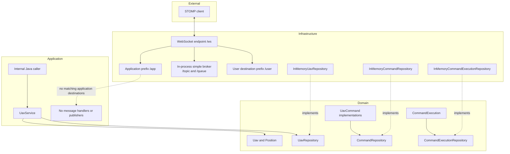
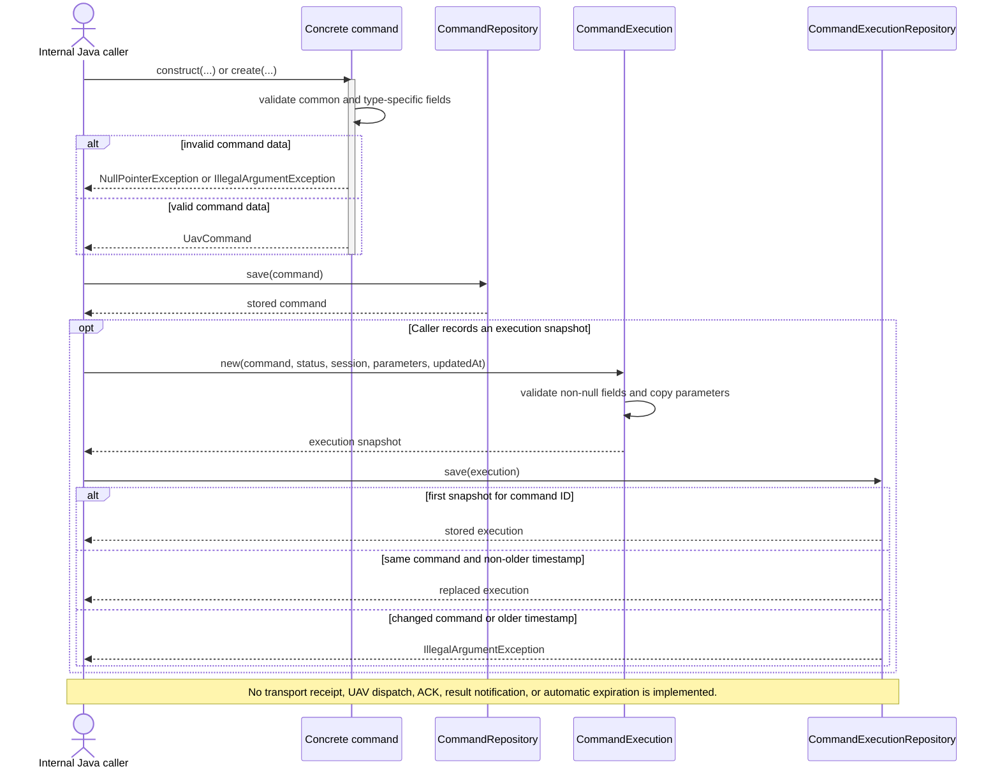
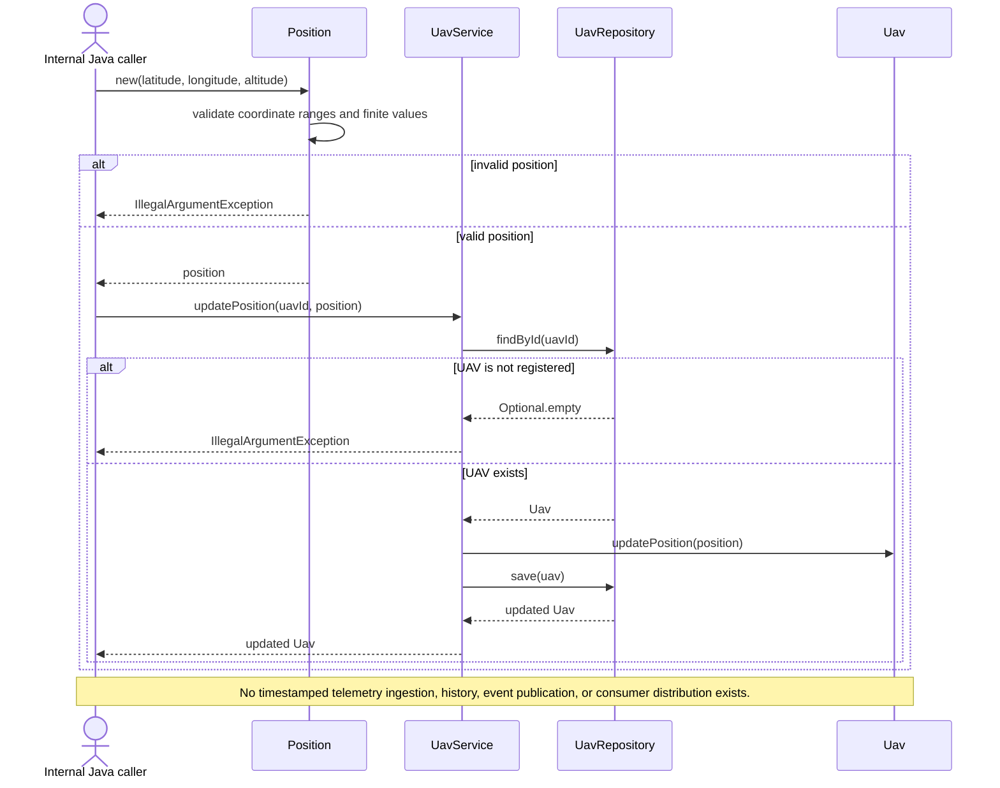
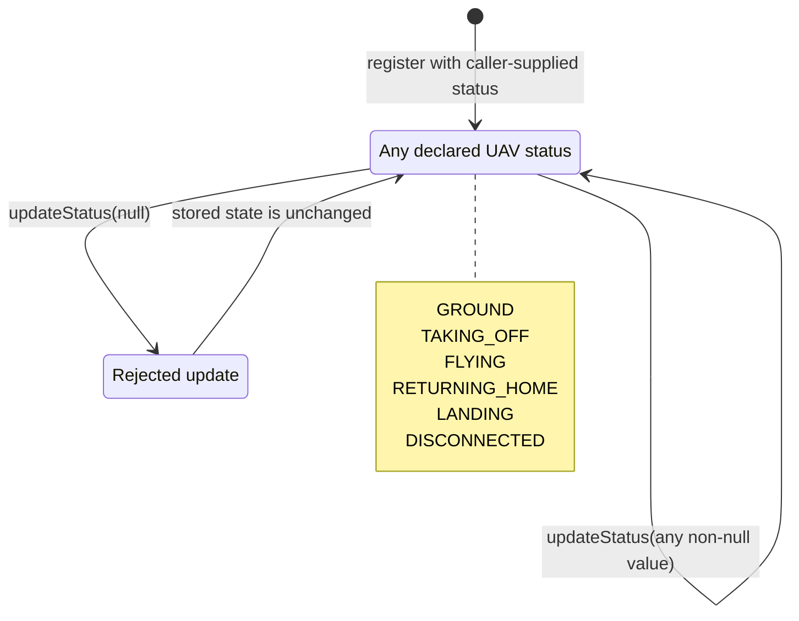
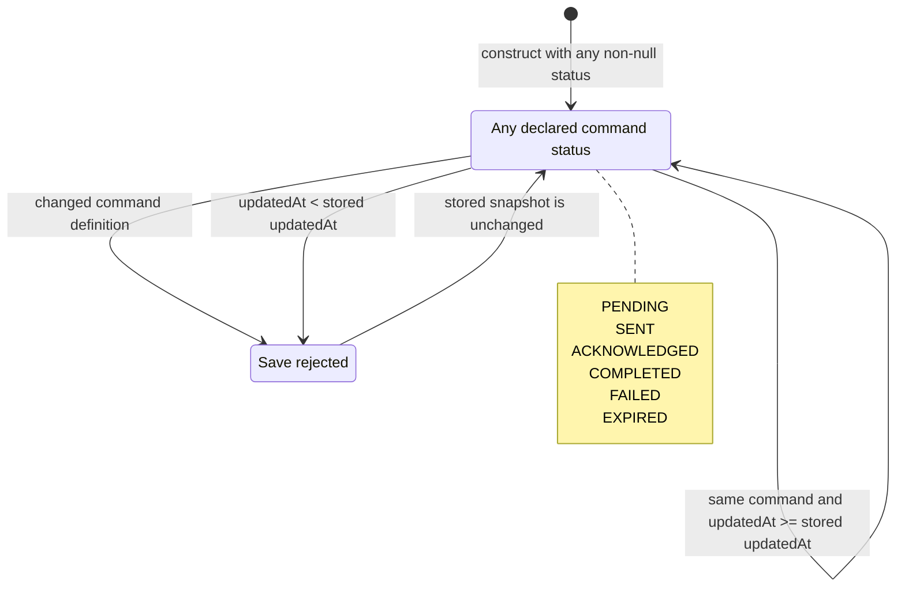
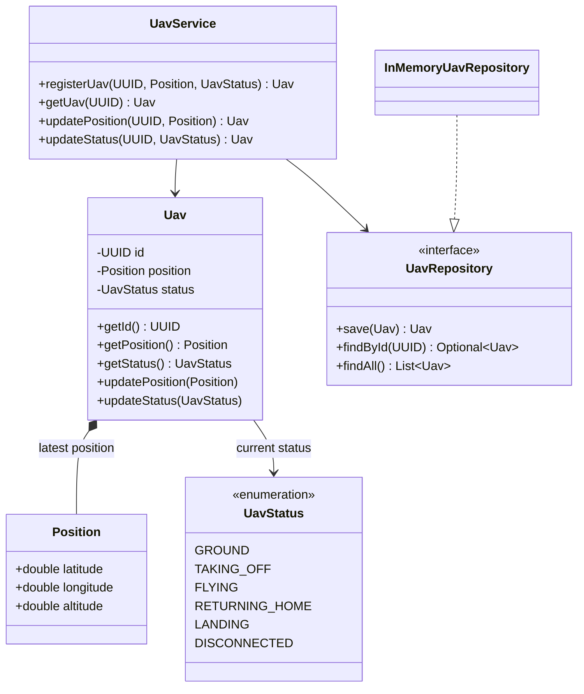
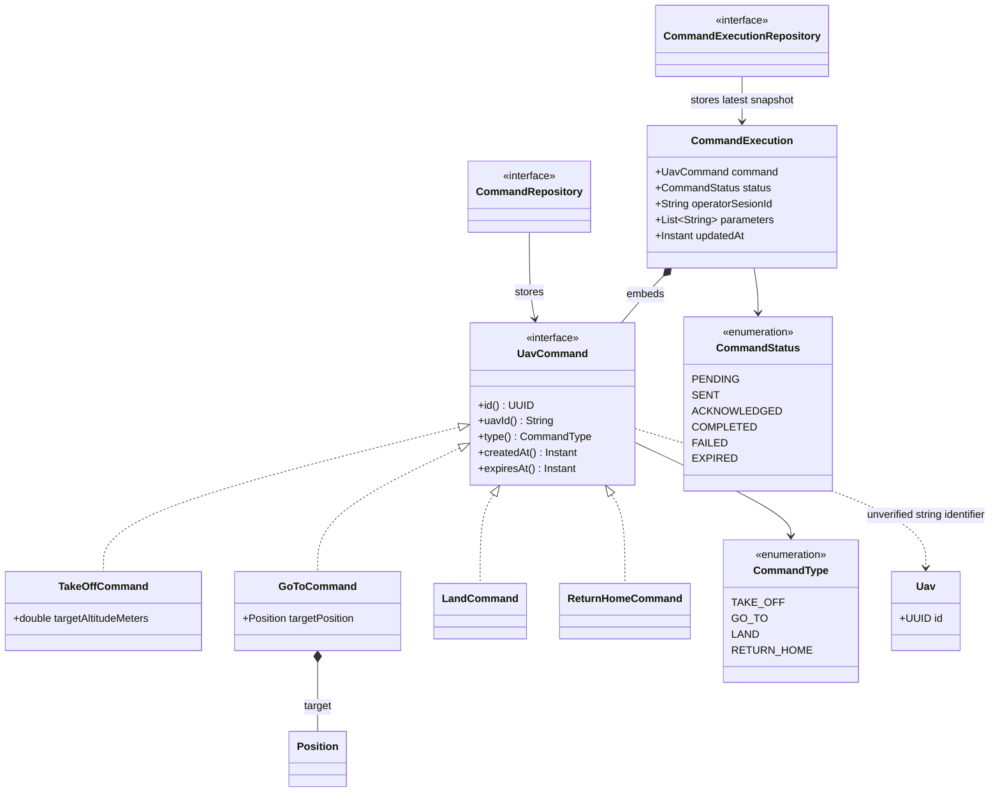

# Mission Control Technical Diagrams

These diagrams describe the implementation currently present in the repository. Planned components from the roadmap are deliberately excluded.

## System Architecture

The implemented UAV use cases are available only to internal Java callers. Command storage and STOMP infrastructure are Spring components, but neither is connected to an application-level messaging workflow.

The repositories use concurrent maps and retain only process-local state. There is no database, external broker, telemetry history, or transactional relationship among the three repositories.

## Command Interaction

There is no implemented sequence from external command receipt to UAV execution. In particular, the code has no command controller or message handler, command application service, dispatcher, ACK consumer, result publisher, retry worker, or expiration scheduler.

The sequence below is the command behavior that can currently be invoked directly in Java: construct a validated command, store it, and optionally create and store an execution snapshot.

## Telemetry Flow

The repository does not define a telemetry message or external telemetry source. Its only telemetry-like operation is an internal position update that replaces the latest `Position` stored for a UAV.

## UAV Status Behavior

`UavStatus` declares six values, but the implementation does not enforce a flight-state machine. Registration accepts any non-null value and `updateStatus` permits every value-to-value transition, including self-transitions.

An update for an unknown UAV is rejected by `UavService` before the entity is modified. Position and altitude do not constrain status changes.

## Command Status Behavior

`CommandStatus` supplies lifecycle vocabulary, not an enforced lifecycle. A `CommandExecution` can be created with any declared status, and the repository does not compare previous and next statuses.

There are no terminal-state guards, automatic transitions, timeout processing, or execution history. The repository keeps only the latest accepted snapshot for each command ID.

## UAV Domain Model

`Position` is immutable and validates latitude in `[-90, 90]`, longitude in `[-180, 180]`, and non-negative altitude. All values must be finite.

## Command Model

The command-to-UAV relationship is conceptual only. Commands store `uavId` as a non-blank `String`, while `Uav` uses a `UUID`; no service currently resolves that string or verifies that the target UAV exists. `CommandExecution` embeds its command and has no independent execution identifier or result payload.

## Deliberately Omitted Views

Mission lifecycle, simulation, operator-interface, and database diagrams are not included because those subsystems do not exist in the current implementation. They belong to the roadmap and should be documented only after their contracts and behavior are implemented.
